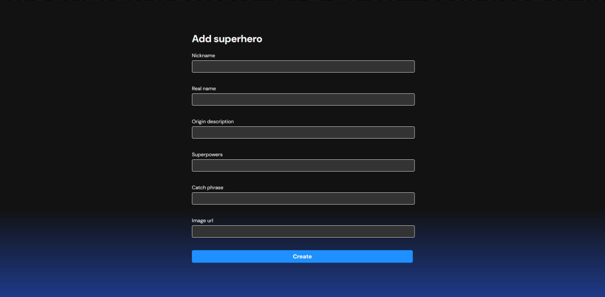
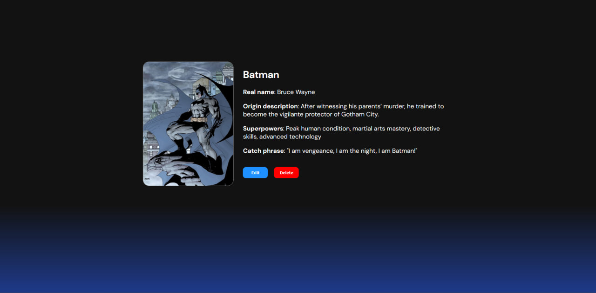
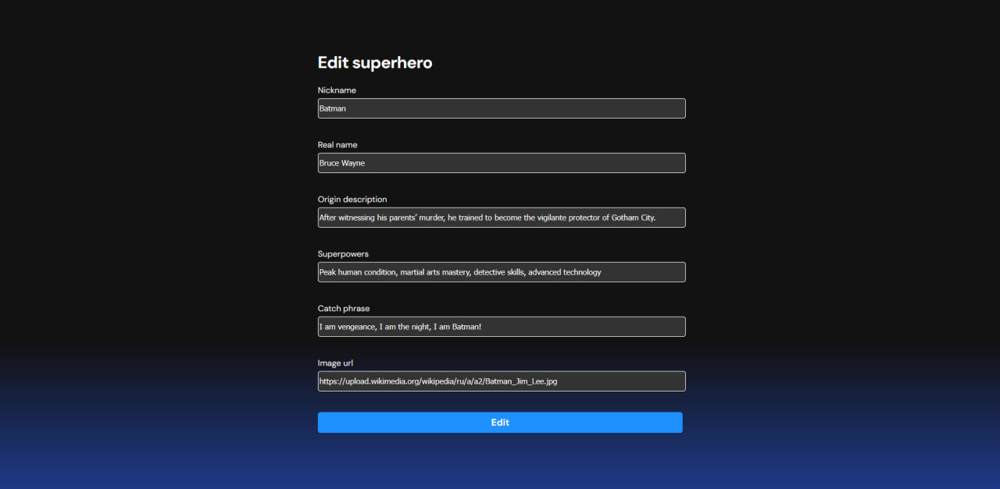
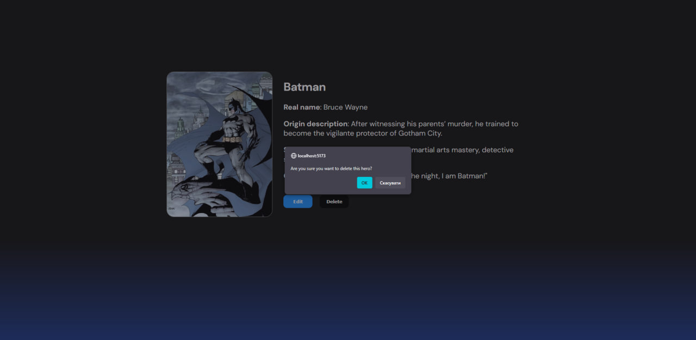

Instructions on how to run project with docker compose:

git clone https://github.com/Dassszgod/Superheroes-fullstack-app.git

cd superhero fullstack

Then in root folder of the project: \
docker compose up --build

Now you can open front-end with: \
http://localhost:5173/

Change ports in docker-compose.yml if needed

Screenshots:

